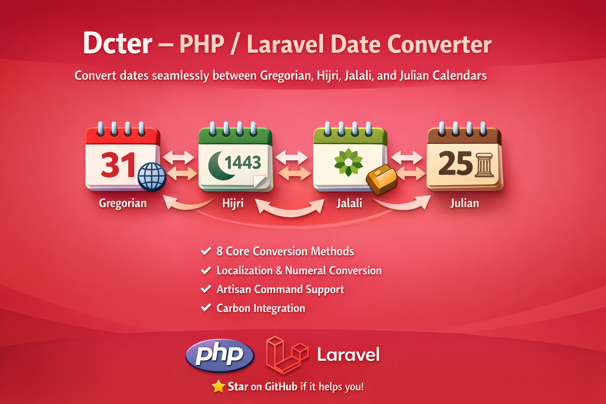

# Dcter :calendar: Dates Converter



[](https://packagist.org/packages/hanifhefaz/dcter)
[](https://packagist.org/packages/hanifhefaz/dcter)
[](https://github.com/hanifhefaz/dcter/actions/workflows/tests.yml)
[](https://github.com/hanifhefaz/dcter/issues)

A Laravel-compatible Composer package that converts dates between **Hijri (Qamari)**, **Jalali (Shamsi/Persian)**, **Gregorian**, and **Julian** calendars.  
It also includes powerful date utilities, localization, numeral conversions, and Artisan command support.

Please consider a ⭐ if this package helps you.

---

## 🧩 Features

✅ Convert between **Hijri**, **Jalali**, **Gregorian**, and **Julian**  
✅ Get **localized month and weekday names** (English, Arabic, Persian)  
✅ Flexible **date formatting**  
✅ Compare and get **differences in days**  
✅ Get **today’s date** in any calendar  
✅ Add or subtract days in any calendar  
✅ Convert **Arabic and English numerals**  
✅ Validate dates across calendars  
✅ Integrated **Laravel Facade** and **Service Provider**  
✅ Artisan command for quick date conversion  
✅ **Carbonize** any calendar date

---

## 🧭 Installation

```bash
composer require hanifhefaz/dcter
```

For Laravel 8+, it auto-registers via package discovery.  
If not, manually add to `config/app.php`:

```php
'providers' => [
    HanifHefaz\Dcter\DcterServiceProvider::class,
],

'aliases' => [
    'Dcter' => HanifHefaz\Dcter\Facades\Dcter::class,
],
```

---

## 🚀 Usage

### 1️⃣ Core Conversions
Dcter includes 8 core conversion methods and 1 Carbonize helper:

| Method | Description |
|--------|--------------|
| `HijriToGregorian($date)` | Hijri ➜ Gregorian |
| `GregorianToHijri($date)` | Gregorian ➜ Hijri |
| `JulianToHijri($date)` | Julian ➜ Hijri |
| `HijriToJulian($date)` | Hijri ➜ Julian |
| `GregorianToJalali($date)` | Gregorian ➜ Jalali |
| `JalaliToGregorian($date)` | Jalali ➜ Gregorian |
| `HijriToJalali($date)` | Hijri ➜ Jalali |
| `JalaliToHijri($date)` | Jalali ➜ Hijri |
| `Carbonize($date)` | Convert any `YYYY-MM-DD` date into a Carbon object |

Example:
```php
use HanifHefaz\Dcter\Dcter;

$date = "2025-03-01";
echo Dcter::GregorianToHijri($date); // 1446-08-29
```

---

## ✨ New Feature Set (v2+)

Below are the new features introduced:

---

### 🗓️ 1. Localized Month Names
```php
Dcter::getMonthName(3, 'hijri', 'ar'); // ربيع الأول
Dcter::getMonthName(1, 'jalali', 'fa'); // فروردین
```

---

### 📅 2. Weekday Names
```php
Dcter::getWeekdayName('2025-10-08', 'gregorian', 'en'); // Wednesday
Dcter::getWeekdayName('1447-04-15', 'hijri', 'ar'); // الأربعاء
```

---

### 🧾 3. Custom Date Formatting
```php
Dcter::formatDate('1447-04-15', 'hijri', 'd F Y', 'en'); 
// 15 Rabi' al-thani 1447
```

---

### ⚖️ 4. Date Comparison
```php
Dcter::compareDates('1447-01-10', '1447-02-01', 'hijri'); 
// returns -1  (first is earlier)
```

---

### 📆 5. Difference in Days
```php
Dcter::diffInDays('1447-01-10', '1447-01-20', 'hijri'); 
// returns 10
```

---

### ⏰ 6. Get Current Date
```php
Dcter::now();           // Gregorian today
Dcter::now('hijri');    // Hijri today
Dcter::now('jalali');   // Jalali today
```

---

### ➕ 7. Add/Subtract Days
```php
Dcter::addDays('1447-01-10', 10, 'hijri'); // 1447-01-20
Dcter::subDays('1447-01-10', 5, 'hijri');  // 1447-01-05
```

---

### 🔢 8. Numeral Conversion
```php
Dcter::toArabicNumerals('2025-10-08'); // ٢٠٢٥-١٠-٠٨
Dcter::toEnglishNumerals('٢٠٢٥-١٠-٠٨'); // 2025-10-08
```

---

### ✅ 9. Date Validation
```php
Dcter::isValidDate('1447-13-01', 'hijri'); // false
```

---

### 🪄 10. Carbon Integration
```php
$carbon = Dcter::Carbonize('1402-01-25');
echo $carbon->addDays(10); // 1402-02-05 00:00:00
```

---

### 🧩 11. Laravel Facade Usage
Once installed, use the Facade directly:
```php
use Dcter;

echo Dcter::GregorianToHijri('2025-03-01');
```

---

### 🖥️ 12. Artisan Command

A handy console command to convert dates:
```bash
php artisan dcter:convert 2025-03-01 --from=gregorian --to=hijri
```

Output:
```
Converted: 1446-08-29
```

---

## 🧪 Tests

You can run all tests with:

```bash
vendor/bin/phpunit
```

Tests are located in `/tests` and cover all core methods.

---

## 🧰 Configuration (optional)

You may publish the config file (if extended later) using:
```bash
php artisan vendor:publish --provider="HanifHefaz\Dcter\DcterServiceProvider"
```

---

## ❤️ Contributions

Contributions are welcome!
Please read the [CONTRIBUTING.md](CONTRIBUTING.md) guide before submitting a PR.

---

## 👨‍💻 Contributors

<table>
  <tr>
    <td align="center"><a href="https://github.com/hanifhefaz/"><br /><sub><b>Hanif Hefaz</b></sub></a></td>
  </tr>
</table>

---

## 🏷️ License

This package is open-sourced software licensed under the **MIT license**.

---

## 🌟 Summary

| Category | Method |
|-----------|---------|
| Conversion | HijriToGregorian, GregorianToHijri, GregorianToJalali, JalaliToGregorian, HijriToJulian, JulianToHijri, HijriToJalali, JalaliToHijri |
| Formatting & Localization | getMonthName, getWeekdayName, formatDate |
| Comparison & Math | compareDates, diffInDays, addDays, subDays |
| Utilities | now, isValidDate, toArabicNumerals, toEnglishNumerals, Carbonize |
| Laravel Integration | Facade, ServiceProvider, Artisan Command |
